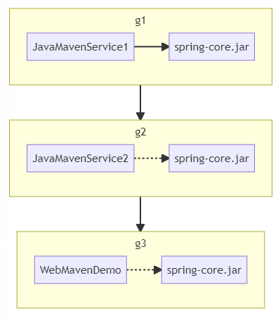
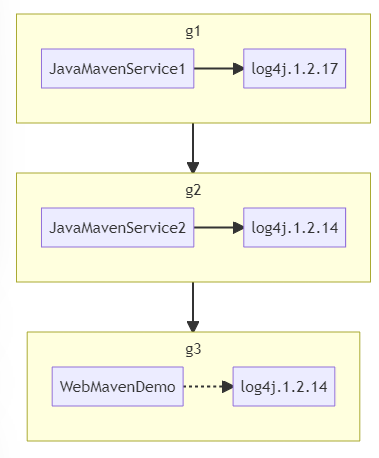
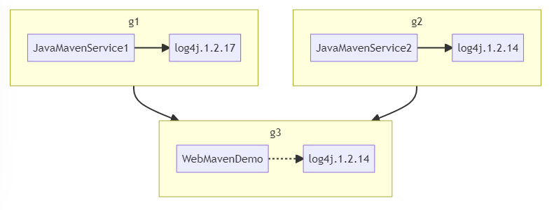

> 本文整理自尚硅谷_封捷

[TOC]

# Maven目录结构

```
Hello
|---src					工程名
|---|---main			源码
|---|---|---java		存放java源文件
|---|---|---resources	存放框架或其他工具的配置文件
|---|---test			存放测试程序
|---|---|---java		存放java源文件
|---|---|---resources	存放框架或其他工具的配置文件
|---pom.xml				Maven的核心配置文件
```

```mermaid
flowchart LR
hello[Hello]
src[src]
main[main]
java1[java]
resources1[resources]
test[test]
java2[java]
resources2[resources]
pom[pom.xml]
hello-->src-->main & test
hello-->pom
main-->java1 & resources1
test-->java2 & resources2
```

# Maven常用命令

执行maven命令必须进入到pom.xml的目录中进行执行

`mvn clean`：将target目录删除，但是已经 install 到仓库里的包不会删除
`mvn compile`：编译主程序
`mvn test-compile`：编译测试程序
`mvn test`：执行测试
`mvn package`：打包
`mvn install`：安装
`mvn deploy`：部署、生成站点

# 仓库

```mermaid
flowchart LR
c1[用户]
c2[用户]
Nexus[私服]
MC[Maven Central]
A[Apache]
other[其他远程仓库]
Nexus<==>c1  
Nexus --> c2
MC & A & other --> Nexus
```

仓库的分类

- 本地仓库：当前电脑上部署的仓库目录，为当前电脑上所有Maven工程服务。默认位置: `C:\USERS\USERNAME\.m2\repository`

- 远程仓库
  - 私服：搭建在局域网环境中，为局域网范围内的所有Maven工程服务
  - 中央仓库：架设在Internet上，为全世界所有Maven工程服务
  - 中央仓库镜像：为了分担中央仓库的流量，提升用户访问速度

仓库中保存的内容：Maven工程

- Maven自身所需的插件
- 第三方框架或工具的jar包
- 自己开发的Maven工程

# 对jar包的管理

1. Maven的核心程序中仅仅定义了抽象的生命周期,但是具体的工作必须由特定的jar包来完成。而jar包本身并不包含在Maven的核心程序中。
2. 当我们执行的Maven命令需要用到某些jar包时, Maven核心程序会首先到本地仓库中查找。
3. 本地仓库的默认位置: `C:\USERS\USERNAME\.m2\repository`
4. Maven核心程序如果在本地仓库中找不到需要的jar包,那么它会自动连接外网,到中央仓库下载
5. 如果此时无法连接外网,则构建失败。
6. 修改默认本地仓库的位置可以让Maven核心程序到我们事先准备好的目录下查找jar包
   - [1]找到Maven解压目录\confsettings.xml
   - [2]在settings.xm|文件中找到localRepository标签
   - [3]将`<localRepository> /path/to/local/repo</localRepository>`从注释中取出
   - [4]将标签体内容修改为已经准备好的Maven仓库目录

# POM

POM：Project Object Model 项目对象模型。

pom.xml对于Maven工程是核心配置文件，与构建过程相关的一切设置都在这个文件中进行配置。重要程度相当于web.xm|对于动态Web工程。

# gav坐标

使用三个向量在仓库中唯一定位一个Maven工程。

```xml
<groupId>com.atguigu.maven</groupId>
<artifactId>hello</artifactId>
<version>4.0.0.RELEASE</version>
```

`groupId`：公司或组织域名的倒序+项目名

`artifactId`：模块名

`version`：版本号。快照SNAPSHOT，发行版RELEASE

Maven工程的坐标与仓库中路径的对应关系

```
com/atguigu/maven/hello/4.0.0.RELEASE/hello-4.0.0.RELEASE.jar
```

# 生命周期

- 各个构建环节执行的顺序：不能打乱顺序，必须按照既定的正确顺序来执行。
- Maven的核心程序中定义了抽象的生命周期，生命周期中各个阶段的具体任务是由插件（jar包）来完成的。
- Maven核心程序为了更好的实现自动化构建，按照这一特点执行生命周期中的各个阶段：不论现在要执行生命周期中的哪一个阶段，都是从这个生命周期最初的位置开始执行。

```mermaid
flowchart LR
a1[清理 clean]
a2[编译 compile]
a3[测试 test]
a4[报告]
a5[打包 package]
a6[部署 deploy]
a1-->a2-->a3-->a4-->a5-->a6
```

Maven有三套相互独立的生命周期，其实不然。这三套生命周期分别是：Clean Lifecycle、Default Lifecycle、Site Lifecycle。

## Clean Lifecycle 

在进行真正的构建之前进行一些清理工作。Clean生命周期一共包含了三个阶段：

- pre-clean 执行一些需要在clean之前完成的工作
- clean 移除所有上一次构建生成的文件
- post-clean 执行一些需要在clean之后立刻完成的工作

## Default Lifecycle 

Default Lifecycle构建的核心部分，编译，测试，打包，部署等等。

```shell
validate
generate-sources
process-sources
generate-resources
process-resources 复制并处理资源文件，至目标目录，准备打包
compile 编译项目的源代码
process-classes
generate-test-sources
process-test-sources
generate-test-resources
process-test-resources 复制并处理资源文件，至目标测试目录
test-compile 编译测试源代码
process-test-classes
test 使用合适的单元测试框架运行测试。这些测试代码不会被打包或部署
prepare-package
package 接受编译好的代码，打包成可发布的格式，如 JAR
pre-integration-test
integration-test
post-integration-test
verify
install 将包安装至本地仓库，以让其它项目依赖。
deploy 将最终的包复制到远程的仓库，以让其它开发人员与项目共享
```

总结：不论要执行生命周期的哪一个阶段，Maven都是从这个生命周期的开始执行。

## Site Lifecycle 

Site Lifecycle 生成项目报告，站点，发布站点。

- pre-site 执行一些需要在生成站点文档之前完成的工作
- site 生成项目的站点文档
- post-site 执行一些需要在生成站点文档之后完成的工作，并且为部署做准备
- site-deploy 将生成的站点文档部署到特定的服务器上

# 依赖

1.  maven解析依赖信息时会到本地仓库中q去查找被依赖的jar包。

   - 对于本地仓库中没有的会去中央仓库去查找maven坐标来获取jar包，获取到jar之后会下载到本地仓库。

   - 对于中央仓库也找不到依赖的jar包的时候，就会编译失败。

2. 如果依赖的是自己或者团队开发的maven工程，需要先使用`mvn install`命令把被依赖的maven工程的jar包导入到本地仓库中。

## 依赖的范围


```xml
<dependencies>
	<dependency>
    	<groupId>org.atguigu.maven</groupId>
        <artifactId>hello</artifactId>
        <version>0.0.1.SNAPSHOT</version>
        <scope>compile</scope>
    </dependency>
</dependencies>
```

`<scope>`就是依赖的范围，常用的有compile、test、provided三种。

|                    | complie | test | provided |
| ------------------ | ------- | ---- | -------- |
| 对主程序是否有效   | √       |      | √        |
| 对测试程序是否有效 | √       | √    | √        |
| 是否参与打包       | √       |      |          |
| 是否参与部署       | √       |      |          |

## 依赖的传递性

优点：可以传递的依赖不必在每个模块工程中都重复声明，在父类工程中依赖一次即可。

注意：非compile范围的依赖不能传递。所以在各个工程模块中，如果有需要就得重复声明依赖。

```mermaid
flowchart TB
wmd[WebMavenDemo]
jms1[JavaMavenService1]
jms2[JavaMavenService2]
jms1-->jms2-->wmd
```

```mermaid
%% https://mermaid-js.github.io/ 在线编译
flowchart TB

subgraph g1
	jms1[JavaMavenService1]-->s1[spring-core.jar]
    direction LR
end
subgraph g2
	jms2[JavaMavenService2]-.->s2[spring-core.jar]
    direction LR
end
subgraph g3
	wmd[WebMavenDemo]-.->s3[spring-core.jar]
    direction LR;
end

g1-->g2-->g3
%%wmd-->jms1-->jms2
```



为JavaMavenService1中增加了一个spring-core.jar包后，会发现依赖的两个项目都自动的增加了这个jar包，这就是依赖的传递性。

版本依赖的原则：

- 路径最短者优先原则

  

  Service1的log4j的版本是1.2.17版本，Service2排除了此包的依赖，自己加了一个Log4j的1.2.14的版本，那么WebMavenDemo项目遵守路径最短优先原则，Log4j的版本和Sercive2的版本一致。

- 路径相同先声明优先原则

  

  这种场景依赖关系发生了变化，WebMavenDemo项目依赖Sercive1和Service2，它俩是同一个路径，那么谁在WebMavenDemo的pom.xml中先声明的依赖就用谁的版本。

## 移除依赖

当要排除某个jar包依赖时，可以配置`<exclusions>`标签，此时可以不写版本号。

```xml
<exclusions>
	<exclusion>
    	<groupId>org.springframework</groupId>
        <artifactId>spring-beans</artifactId>
    </exclusion>
</exclusions>
```

## 统一管理依赖的版本

应用场景：这里需要对spring各个jar包的依赖版本进行管理，如需要升级到4.1.1。

配置方式：使用properties标签，里面可以自定义版本的标签名。在使用的地方使用${自定义标签名}

```xml
<properties>
    <hzg.spring.version>4.1.1</cvzhangshi.spring.version>
    <hzg.junit.version>3.8.1</hzg.junit.version>
</properties>
...
<dependencies>
    <dependency>
        <groupId>org.springframework</groupId>
        <artifactId>spring-core</artifactId>
        <version>${hzg.spring.version}</version>
        <scope>complie</scope>
    </dependency>
</dependencies>
```

# 继承

需求：统一管理各个模块工程中对junit依赖的版本

解决思路：将junit依赖统一提取到父工程中,在子工程中声明junit依赖时不指定版本，以父工程中统一设定的为准，同时也便于修改。

操作步骤：

- 创建一个Maven工程作为父工程，注意打包方式为pom。

  ```xml
  <groupId>com.atguigu.maven</groupId>
  <artifactId>Parent</artifactId>
  <version>0.0.1.SNAPSHOT</version>
  <packaging>pom</packaging>
  ```

- 在子工程中声明对父工程的引用

  ```xml
  <!-- 子工程中声明父工程-->
  <parent>
      <groupId>com.atguigu.maven</groupId>
      <artifactId>Parent</artifactId>
      <version>0.0.1.SNAPSHOT</version>
      
      <!-- 以当前文件为基准的父工程pom.xml文件的相对路径-->
      <relativePath>../Parent/pom.xml</relativePath>
  </parent>
  ```

- 将子工程的坐标中与父工程坐标中重复的内容删除

- 在父工程中统一管理junit的依赖

  ```xml
  <!--配置依赖的管理-->
  <dependencyManagement>
      <dependencies>
          <dependency>
              <groupId>junit</groupId>
              <artifactId>junit</artifactId>
              <version>4.9</version>
              <scope>test</scope>
          </dependency>
      </dependencies>
  </dependencyManagement>
  ```

- 在子工程中删除junit依赖的版本号部分。注意：配置继承后，执行安装命令时要先安装父工程。

# 聚合

作用：一键安装各个模块工程

配置方式：在一个”总的聚合工程“中配置各个参与聚合的模块

使用方式：在聚合工程的pom.xml上点右键->run as->maven install

```xml
<!-- 配置聚合 -->
<modules>
    <!-- 指定各个子工程的相对路径 -->
    <module>../HelloFriend</module>
    <module>../MakeFriends</module>
    <module>../Hello</module>
</modules>
```

